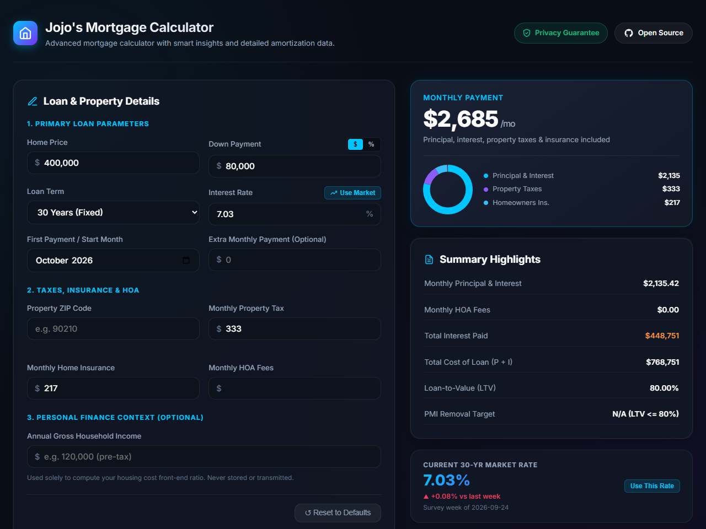

# Jojo's Mortgage Calculator

An advanced, interactive mortgage calculator with real-time PITI payment breakdowns, dynamic property tax lookup by ZIP code from US Census ACS data, 50+ years of Freddie Mac PMMS historical mortgage rate trends, smart personal finance insights, and full amortization schedules.



---

## Running the Application

Because the application uses the browser `fetch()` API to asynchronously load datasets (such as property tax rates by ZIP code), it should be served via a local web server rather than opening `index.html` directly from the filesystem.

### Using Python's Built-in HTTP Server (not suitable for production!!)

Python includes a built-in static HTTP server with zero dependencies or external setup:

1. **Open a terminal** and navigate to the project directory:
   ```bash
   cd /path/to/mortgage-calculator
   ```

2. **Start the local HTTP server**:
   ```bash
   python -m http.server 8000
   ```

3. **Open the application** in your browser:
   [http://localhost:8000](http://localhost:8000)

> **Why a server process is required**:  
> Modern web browsers (Google Chrome, Microsoft Edge, Mozilla Firefox, Safari) enforce strict Cross-Origin Resource Sharing (CORS) and Same-Origin security policies on local `file:///` URLs. When `index.html` is opened directly via double-clicking in a file manager, the browser assigns it an `origin: null` or restricts local file access, preventing `fetch()` from reading JSON files like `js/propertyTaxesByZipCode.json`. Running Python's built-in `http.server` provides a standard HTTP origin (`http://localhost:8000`), allowing all dynamic data lookups to work seamlessly.

---

## Core Features

- **Real-Time Payment Breakdown**:
  - Live calculations for Principal & Interest, Property Taxes, Homeowner's Insurance, HOA Dues, and Private Mortgage Insurance (PMI).
  - Interactive Canvas donut chart and legend updating instantly on any input change.
- **Dynamic Property Tax Lookup by ZIP Code**:
  - Enter any 5-digit US ZIP code to automatically look up the aggregate effective property tax rate derived from the US Census Bureau 5-Year American Community Survey (ACS).
  - Automatically recalculates monthly property tax and total monthly payment based on the home price and effective tax rate.
  - Responsive rate badge feedback, with instant fallback if unlisted or cleared.
- **Freddie Mac PMMS Historical Mortgage Rates**:
  - Visualizes weekly Primary Mortgage Market Survey 30-year fixed rate data from 1971 to present.
  - Switchable timeframe views: 1Y, 5Y, 10Y, 20Y, and 50Y.
  - Interactive rate application: click any point on the chart to apply that historical rate to your calculation.
  - "Use Market Rate" button to quickly apply the latest published Freddie Mac average.
- **Detailed Amortization Schedule**:
  - Annual summary rows expandable into 12-month breakdowns.
  - Displays cumulative interest paid, interest remaining, cumulative principal paid, principal remaining, total balance remaining, and annualized balance interest rate for every period.
  - One-click CSV export of the entire amortization table.
  - Extra monthly principal payment modeling to see payoff acceleration and interest savings.
- **Smart Financial Insights**:
  - **Down Payment Trade-Off**: Compares monthly payment and lifetime interest across down payment levels.
  - **5-Year Historical Comparison**: Compares current scenario against the prevailing rate 5 years ago.
  - **Shorter Loan Term Analysis**: Explores payments and interest savings when switching to a shorter term (e.g. 30yr vs 20yr or 15yr).
  - **Rate Sensitivity (±1.00%)**: Shows monthly dollar delta and interest impact if rates rise or fall by 1%.
  - **Housing Cost Ratio**: Optional pre-tax gross income entry benchmarks front-end debt-to-income against standard lending guidelines (≤28%, 28–36%, >36%).

---

## Dataset Utilities

The repository includes standalone Python utilities to fetch and generate the underlying datasets:

### 1. Property Tax Data by ZIP Code (`fetch_property_tax_data.py`)
Aggregates median real estate taxes and home values from the US Census Bureau ACS 5-Year dataset across 3,200+ US counties and maps them to 35,000+ ZIP codes using the HUD-USPS crosswalk:
```bash
python fetch_property_tax_data.py \
    --hud-crosswalk data/hud_usps_crosswalk_ZIP-COUNTY_062026.xlsx \
    --summarized-output-path js/propertyTaxesByZipCode.json
```
- Automatically caches downloaded Census API responses to temporary storage so subsequent runs execute offline in seconds.
- Run `python fetch_property_tax_data.py --help` for all options.

### 2. Freddie Mac PMMS Historical Rates (`generate_pmms_rates.py`)
Downloads and extracts historical weekly rate data directly from Freddie Mac's official spreadsheet:
```bash
python generate_pmms_rates.py ./js
```

---

## Testing

The project includes an automated visual and behavioral test suite powered by Playwright and Pytest.

To run the complete test suite:
```bash
python -m pytest -v
```

Tests automatically launch a headless browser, run through UI scenarios, verify calculations, and capture screenshots and recorded `.webm` videos in `test-artifacts/`. See [README_TESTS.md](README_TESTS.md) for full details.

---

## Architecture & Technology

- **Pure Client-Side**: Standard HTML5, CSS3, and Vanilla JavaScript.
- **Zero Build Step**: No Node.js, webpack, Vite, or npm build step required.
- **Libraries via CDN**:
  - [Chart.js](https://www.chartjs.org/) for historical rate charting and payment donut breakdown.
  - Google Fonts (Inter) for clean, modern typography.

---

## License

This project is licensed under the MIT License - see the [LICENSE](LICENSE) file for details.
